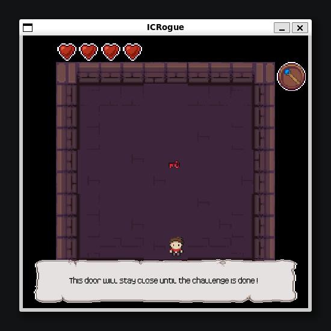
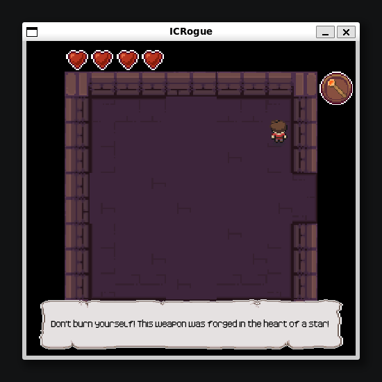
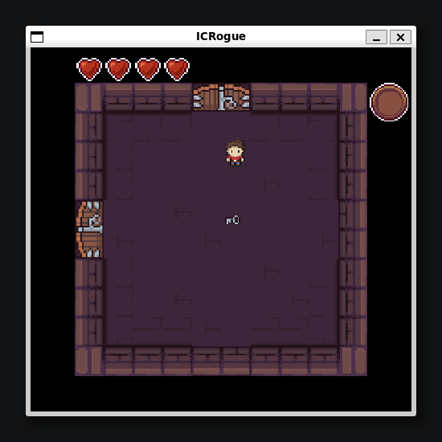
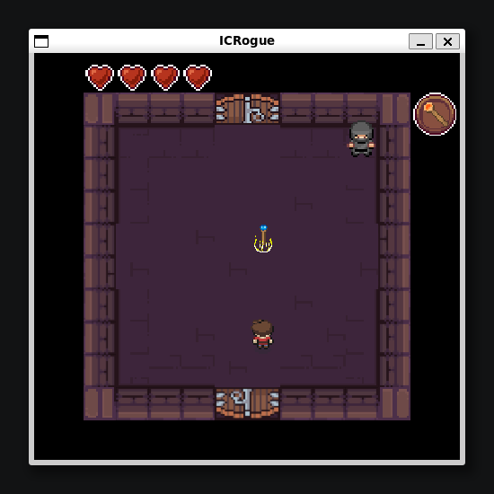
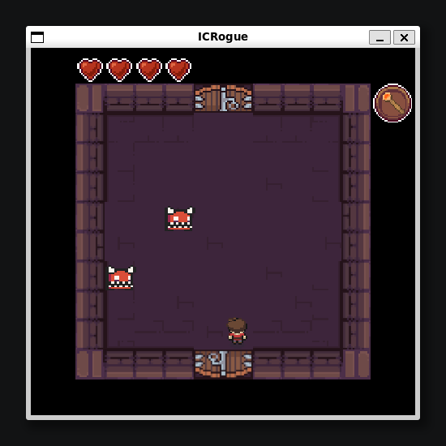
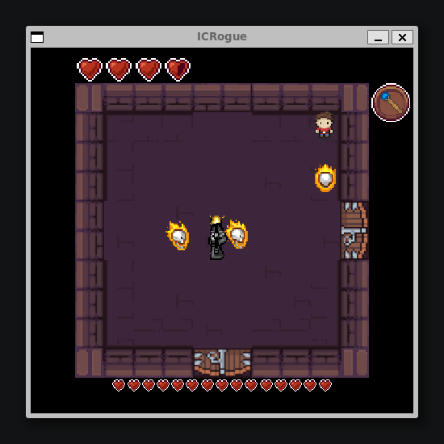

# ICRogue

[](https://github.com/natamun/game-ICRogue/actions/workflows/build.yml)


A small [Roguelike](https://en.wikipedia.org/wiki/Roguelike)-style dungeon crawler: explore a procedurally generated (or fixed) level room by room, collect keys and weapons, fight turrets and flying flame skulls, and defeat the Dark Lord to win.

Built in **2022** for the **CS-107** course (EPFL), on top of a 2D grid-based game engine provided by the course, my second programming project. The mandatory part of the assignment (4 steps) had to be implemented on top of that engine: a player character, items, projectiles, multi-room level exploration, connectors/doors, enemies and win/lose conditions, and procedural level generation. A 5th, open-ended "extensions" step was then used to go further: new enemies (the Dark Lord and his flame skulls), new rooms, two weapons (fire/water staves), a friendly NPC, a health/heart system, and menu screens. I completed the whole project on my own.

This repository has since been refactored to be a standalone, exportable project: everything specific to the course's grading/submission process (the submission script with hardcoded student tokens, tutorial-only scaffolding, IDE project files, unused assets from earlier course exercises, etc.) has been removed, and the project is now compiled and launched through a simple `Makefile` (see [Compilation](#compilation) below).

<p align="center"><br></p>

## Table of contents

- [Project structure](#project-structure)
- [Compilation](#compilation)
- [How to play](#how-to-play)
- [How ICRogue works](#how-icrogue-works)
  - [Rooms](#rooms)
  - [Levels](#levels)
  - [Connectors](#connectors)
  - [Level generation](#level-generation)
  - [Interactions](#interactions)
  - [Health & combat](#health--combat)
  - [Weapons](#weapons)
  - [Enemy AI](#enemy-ai)
  - [Menus](#menus)
  - [Sprites & animation](#sprites--animation)
  - [Encapsulation](#encapsulation)
- [Credits](#credits)

## Project structure

```
.
├── Makefile
├── consignes.pdf              # original assignment specification (French)
├── icrogue                    # generated by `make`, the game launcher script
├── assets/                    # sprites, fonts (loaded at runtime)
├── screenshots/               # images used in this README
├── out/                       # compiled .class files (created by `make`)
└── src/icrogue/
    ├── Play.java                # main entry point (parses CLI args, runs the game loop)
    ├── ICRogue.java             # the game itself: level setup, pause/reset/win/lose
    ├── ICRogueBehavior.java     # grid cell types (ground / wall / hole) and traversability
    ├── ICRogueKeybinds.java     # all key bindings, grouped in one place
    ├── RandomHelper.java        # a seeded RNG helper
    ├── actor/
    │   ├── ICRogueActor.java, ICRoguePlayer.java, Connector.java, ICRogueGraphics.java
    │   ├── enemies/              # Enemy, Turret, FlameSkull, DarkLord
    │   ├── items/                # Item, Cherry, Key, Heart, Weapon, FireStaff, WaterStaff
    │   ├── projectiles/          # Projectile, FireBall, WaterBall, Arrow, Consumable
    │   └── friendlyNPC/          # NinjaPNJ
    ├── area/
    │   ├── Level.java, ICRogueRoom.java, ConnectorInRoom.java
    │   └── level0/                # Level0 (map generation) + every Level0*Room variant
    ├── handler/                   # ICRogueInteractionHandler (interaction dispatch)
    ├── MenuScreens/               # Pause / Game Over / Won screens
    └── engine/                    # 2D grid game engine provided by the course, not written by me
        ├── game/, io/, math/, recorder/, signal/, window/
```

## Compilation

The project is compiled using a `Makefile`, calling `javac` directly: there are no external dependencies, only the standard Java library.

Requires a JDK (17 or later). Check if you already have one:

```bash
java -version
```

If not, install one:

```bash
# Ubuntu / Debian / WSL
sudo apt install openjdk-17-jdk

# macOS (Homebrew)
brew install openjdk@17

# Windows
# Download and install from https://adoptium.net/
```

The `Makefile` includes the following rules:
* `all`: Compiles the project and generates the `icrogue` executable script.
* `run`: Builds if needed, then launches the game with a random level.
* `classic`: Builds if needed, then launches the game with the fixed, curated level.
* `debug`: Builds if needed, then launches the game with a small fixed level used for testing.
* `clean`: Removes compiled class files.
* `fclean`: Removes compiled class files and the `icrogue` script.
* `re`: Recompiles the project from scratch.

To compile and launch:

    make
    ./icrogue [random|classic|debug]

Called with no argument, `./icrogue` defaults to a random level. An unrecognized argument prints a usage message instead of launching the game.

## How to play

**Controls**

| Key | Action |
|---|---|
| Arrow keys | Move |
| `E` | Interact / close dialog |
| `W` | Sprint (doubles movement speed) |
| `Q` | Use weapon |
| `S` | Switch weapon |
| `O` | Reset the game |
| `Escape` | Pause |

(To change any of these, edit `ICRogueKeybinds.java`.)

**Objective**

Defeat the Dark Lord, ruler of the dungeon, to win.

- Explore the level and find a **grey key** to unlock the turret room, and a **fire staff** (available in a room that needs no key) to fight your way through it.
- Turrets shoot arrows down their row/column whenever they see you, and deal contact damage if you get too close; you'll need a weapon to take them down.
- Once the turrets are defeated, find a **water staff** and the **red key** to unlock the boss room.
- The Dark Lord surrounds himself with flying flame skulls that chase you: fire won't help against them, so switch to the water staff. Damage the boss himself with either weapon's projectiles, but stay out of melee range: his touch can kill you outright.

The game is tuned to be hard on purpose. If you want an easier time with the boss fight, bump up `WATERBALL_DAMAGE` in `src/icrogue/actor/projectiles/WaterBall.java`.

## How ICRogue works

### Rooms

An `ICRogueRoom` is a single screen the player can stand in. It directly implements the engine's `Logic` interface, so every room is itself a boolean signal: `isOn()` starts out meaning "has the player visited this room", and each room subclass narrows that down to its own challenge by overriding it: a `Level0ItemRoom` is only "on" once it's been visited *and* every item inside has been collected, a `Level0EnemyRoom` only once it's been visited *and* every enemy inside is dead. The generic door-opening logic (below) never needs to know what a room's actual challenge is; it just asks whether the signal is on.

### Levels

A `Level` is the 2D grid of `ICRogueRoom`s that makes up a dungeon. It implements `Logic` too, wired directly to its boss room's own signal: beat the boss, and the level's signal turns on, which ends the game as a win. A level can be built two different ways, see [Level generation](#level-generation) below.

### Connectors

A `Connector` is the door between two adjacent rooms, in one of 4 states: `INVISIBLE`, `CLOSED`, `LOCKED` or `OPEN`. Walking through an open one moves the player to the matching position in the neighboring room. Each room owns its connectors and opens them itself, automatically, the moment its own signal turns on, except connectors that also require a key, which stay `LOCKED` regardless of the room's state until the player has picked up the matching key. Progression is expressed as a small circuit of boolean signals (room → connector) rather than a pile of ad hoc flags.

<p align="center"><br><sub>Trying an unopened connector: the room's own signal is still off, so the door tells the player why.</sub></p>

### Level generation

`Level0` can build its map in two different ways: two small **fixed maps** (`classic`, the intended way to experience the game, and `debug`, a minimal map used during development), or full **random generation**:

1. **Growth from the center.** The map starts as an oversized empty grid (much larger than the number of rooms actually needed), with a single room placed at its center. From there, the algorithm repeatedly looks at every already-placed-but-unexplored room, picks a random number of its free neighboring cells, claims them as new rooms, and marks the room "explored", a randomized flood fill that keeps growing outward until the target room count is reached. This is what produces a different, organically-shaped, fully connected dungeon layout on every run.
2. **Guaranteed progression path.** A pure random walk doesn't know anything about game balance, so on top of that shape, the algorithm pins down a few rooms deliberately: one of the already-placed rooms becomes the boss room, and separately, a turret room is picked and then extended, cell by cell, into a physically adjacent chain: turret room → the weapon room that counters the boss → the boss key room. This guarantees the level is always solvable and that the difficulty curve (fight the turrets, get the right weapon, then the key) is respected, no matter how the rest of the map turned out.
3. **Defensive retries.** In rare cases the random growth produces a degenerate, hard-to-work-with shape (nicknamed a "snail" map while I was testing it) where step 2 can't find room to place its chain. Rather than special-casing that shape, generation is wrapped in a retry loop: on failure, it's silently discarded and regenerated from scratch until a valid layout comes out.

### Interactions

Every actor that can affect another one (the player, projectiles, ...) is an `Interactor`; anything that can be affected (items, enemies, connectors, ...) is `Interactable`. This comes from the engine's double-dispatch visitor pattern: an interactor's `interactWith(...)` hands control to its own interaction handler, which then decides what actually happens depending on the concrete type it receives: collecting an item, unlocking a door, damaging an enemy, etc., all without a single `instanceof` check in the game code.

<p align="center"><br><sub>The friendly NPC is, mechanically, just another `Interactable`: instead of an instant silent pickup like a regular item, interacting with it shows a dialog first, then it vanishes.</sub></p>

Keys and weapons are collected the exact same way: walking into them triggers a contact interaction, and the interaction handler decides what "collecting" means for that particular `Interactable`.

<p align="center">
<br><sub>Collecting the grey key.</sub>
</p>
<p align="center">
<br><sub>Collecting the water staff.</sub>
</p>

### Health & combat

Health is tracked in half-heart units (`PLAYER_MAX_HEALTH = 8`, drawn as the 4 hearts in the corner, each rendered full, half or empty). The player's max health isn't just a display number, either: the Dark Lord's melee touch deals exactly `PLAYER_MAX_HEALTH` damage, which is what makes it an instant kill if he catches you. The boss has his own separate health pool, drawn by the exact same code: the player and the Dark Lord both implement a shared `ICRogueGraphics` interface that holds the heart sprites, the dialog box and the weapon icon as common, reusable graphics.

Healing is scarce by design: every enemy killed inside a `Level0EnemyRoom` (turret room, boss room) spawns a heart (always at the same fixed spot in the room, so a multi-kill just stacks hearts on top of each other), which heals 1 or 2 points on pickup, capped at the max.

### Weapons

The player can hold more than one `Weapon` at a time. `S` cycles through whichever ones are currently equipped (wrapping back to the first) and swaps the icon shown in the corner for the newly active weapon's own icon; holding `Q` fires that weapon's specific projectile once its cooldown has elapsed. The fire and water staves share the exact same equip/switch/fire code path; only the projectile type, damage and cooldown differ between them, and the difference is deliberate: the water staff fires twice as fast as the fire staff (a 0.5 cooldown against the default 1). Picking either one up shows a short help message ("Press Q to use it", "Press S to switch weapon") through the same dialog box used for the friendly NPC.

### Enemy AI

Each enemy type gets its own small, self-contained behavior:

- **Turret**: its field of view is restricted to its own row and column (`getAllCellInLineOfActor()`), not the whole room, so it only ever fires, or deals contact damage, while the player is lined up with it. The turret room itself has some randomness too: it spawns between 2 and 5 turrets at random positions every time it's generated, and each turret's firing directions are derived from where it landed (a corner turret only covers the 2 walls it faces, an edge one covers 3, and one in the open covers all 4).
- **Flame skull**, the opposite: its field of view is the *entire* room. Every update it recomputes a direction toward the player's last known position and takes one step that way, so it keeps closing in no matter where it spawned.
- **Dark Lord**: moves in a random direction every couple of seconds, turning around when it walks into a wall, and periodically summons a new flame skull right in front of itself. Taking damage makes it lurch a short distance, which (deliberately) makes it harder to stun-lock with a stream of projectiles.

<p align="center">
<br><sub>Turrets: only fire down their own row/column.</sub>
</p>
<p align="center">
<br><sub>The Dark Lord, mid-fight, with three flame skulls closing in.</sub>
</p>

### Menus

There are 3 menu screens (`MenuScreens/`), all reusing the engine's generic `PauseMenu` overlay: each one is just a subclass that overrides `drawMenu(...)` to render its own colored text (white for pause, red for game over, yellow for victory) over the frozen game. `Escape` toggles the pause menu manually, while the other two are triggered automatically, every frame, by two simple checks in `endGame()`: the player's health hitting zero shows Game Over, and the boss room's own signal turning on, the exact same `Logic` mechanism described under [Rooms](#rooms), shows You Won.

### Sprites & animation

Most actors are animated rather than drawn as a single static image. `Sprite.extractSprites(...)` slices one sprite sheet into a `Sprite[4][nbFrames]` grid (4 rows, one per facing direction, and as many columns as there are animation frames), and `Animation.createAnimations(...)` wraps each row into a looping `Animation` that cycles through its frames over time. A shared helper on `ICRogueActor` then just picks the right one of the 4 to draw and update based on the actor's current orientation, so every animated actor (player, enemies, ...) reuses the exact same draw/update code regardless of its sprite sheet. The Dark Lord takes it one step further and keeps two full sets of animations (walking and spell-casting) and switches between them depending on whether he's currently moving.

### Encapsulation

The assignment put a strong emphasis on encapsulation, and the design follows through on it: fields are private, cross-class access goes through `protected` methods rather than public getters/setters, and a room never exposes its connectors directly: code outside a class works with the behavior it offers, not with its internals.

## Credits

- The base game engine and the assignment specification (`consignes.pdf`) are by S. Abuzakuk, J. Sam and B. Jobstmann, for EPFL's CS-107 course.

---

Made with ❤️ by [natamun](https://github.com/natamun)
